# I. Introductions
Welcome to the **HeRAMS User Manual**. This manual was designed for users of the [HeRAMS platform](https://herams.org/login) and aims to proivde essential information
on key components of the platform. The first two chapters are intended for all users and include step-by-step descriptions on how
to [access the HeRAMS platform](#1-login--user-profile) as well as a brief overview on the HeRAMS project [dashboards](#2-explore-data). [Chapter 3](#3-edit-data) provides a brief introduction on data editing. 
[Chapter 4](#4-herams-administration) of this guide is intended for in-country administrators of HeRAMS projects and covers topics such as user management,
dashboard configuration and other functionalities expected to be carried out by administrators. 

# II. Table of Content

1. [Login & User Profile](#1-login--user-profile)
	 - [Login](#login)
	   - [Rest Password](#rest-password)
	   - [Logout](#logout)
	  - [User Profile](#user-profile)
		- [Register (Create a User Account)](#register-create-a-user-account)
		- [Update your User Profile](#update-your-user-profile)
		- [Change Password](#change-password)
		- [Add a Profile Picture](#add-a-profile-picture)	
2. [Explore Data](#2-explore-data)
	 - [Worldview](#worldview)
	 - [Dashboard](#dashboard)
		- [Customizing the dashboard](#customizing-the-dashboard)
		- [Default Dashboard Pages](#default-dashboard-pages)
	 - [Download data](#download-data)
		- [Download the entire data set](#download-the-entire-data-set)
		- [Data Encoding in Excel](#data-encoding-in-excel)
3. [Edit Data](#3-edit-data)
	- [Access the Data Edit Interface](#access-the-data-edit-interface)
	- [Edit a Health Facility](#edit-a-health-facility)
	- [Update a Health Facility](#update-a-health-facility)
	- [Register a new Health Facility](#register-a-new-health-facility)
	- [Delete a Health Facility](#delete-a-health-facility)
4. [Project Administration](#4-herams-administration)
	- [Workspaces](#workspaces)
		- [Workspace Permissions](#workspace-permissions)
		- [Add a User to a Workspace](#add-a-user-to-a-workspace)
		- [Remove a User from a workspace](#remove-a-user-from-a-workspace)
		- [Alter a user's Permission to a Workspace](#change-a-users-workspace-permission)
		- [Create a New Worksapce](#create-a-new-worksapce)
		- [Delete a Workspaces](#delete-a-workspace)
	- [Projects](#projects)
		- [Project Permissions](#project-permissions)
		- [Add a User to a Project](#add-a-user-to-a-project)
		- [Remove a User from a Project](#remove-a-user-from-a-project)
		- [Change a User's Project Permissions](#change-a-users-project-permissions)
		- [Modify a Project](#modify-a-project)
	- [Configure the Project Dashboard](#configure-the-project-dashboard)
		- [Add a New Dashboard Page](#add-a-new-dashboard-page)
		- [Update a Dashboard Page](#update-a-dashboard-page)
		- [Delete a Dashboard Page](#delete-a-dashboard-page)
		- [Add an Element to a Page](#add-an-element-to-a-page)
		- [Modify an Element on a page](#modify-an-element-on-a-page)
		- [Remove an elements or pages from the dashboard](#)
5. [FAQ](#faq)

#	 1. Login & User Profile
This chapter provides step-by-step instructions on how to access the HeRAMS platform, create a user acount and update your user profile. 
### Login
New users without an existing account, will have to create an account before being able to log on to HeRAMS. 
To create your user account in [HeRAMS](https://herams.org/login), follow the instruction in section [Register](#register-create-a-user'account) further below. 

1. To access the HeRAMS platform, open the link https://herams.org in your browser of choice. 

	</img>
	<i> It is recommended to user either FireFox or Chrome. </i>

2. A pop-up window will appear prompting you to enter your username (email) and password. 
3. Enter you username (email) and password in the designated fields and click the </img> button. 
4. Click the </img> to login. 

	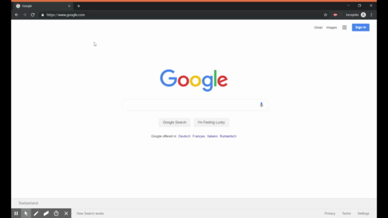</img>

#### Rest Password

In case you forgot your password, the instruction below will guide through the steps to reset your password. 

1. To reset your password, open the link [https://herams.org](https://herams.org) in your browser.
2. On the sign in page, click the [Reset password](https://herams.org/user/forgot) link located below field to enter your password.
3. Enter your email address in the top field.
4. Below the email field, you should see a Captcha image similar to the one displayed here </img>.
Enter the the characters displayed into the field below. 
5. Click the </img> button.
6. An automated email will be sent to you, containing a link that allows you to enter a new password. 

	</img>
	<i> If you haven't received an email, make sure to check your spam folder.</i>

7. Open the link and enter your new password.
8. Click the </img>  button to confirm your new password. 
9. To login into HeRAMS, return to the [sign in page](https://herams.org/user/login).

	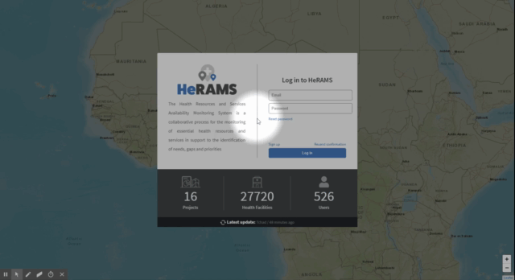</img>

### Logout

To logout, click the  </img> button in the top right corner of your screen. 

### User Profile
Each user has a profile associated with their account. This permits you do make any changes to your account (e.g. change your email address or password) without additional support.

#### Register (Create a User Account)

1. To register as a new user, open the link [https://herams.org](https://herams.org) in your browser.
2. On the sign-in page, click the [sign-up](https://herams.org/user/register) link located just above the </img> button.
3. On the page that opens, enter your name, email and password. 

	</img>
	<i> Please note that your email acts as username.</i>

4. Submit your information by clicking the </img> button. 
5. A confirmation email will be sent to the email address you use to register with. 

	</img>
	<i> If you haven't received a confirmation email, make sure to check your spam folder.</i>

6. Confirm your registration by clicking on the link in your email.

	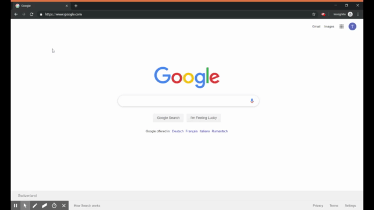</img>

#### Update your User Profile

1. To update your user profile or account details (i.e. email and password), click on your username on the top right corner of the screen.  
2. This opens your [user profile](https://herams.org/user/settings/profile) and allows you to change your personal information such as your name, organization and contact details. 

	</img>
	<i> Please note that first name, last name and organization are mandatory.</i>

#### Change Password

1. To alter your password, open your user profile as explained [above](#update-your-user-profile).  
2. Click on the [account](https://herams.org/user/settings/account) link to access your account information. 
3. You should now be able to change your email address and enter a new password. 
4. Make sure to click the </img> button to confirm your changes. 

	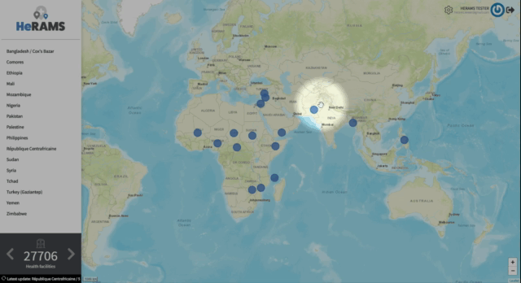</img>

#### Add a Profile Picture

You can further personalize your account by adding a profile picture. In order for your profile picture to appear, you will have to register your email address at [Gravatar](https://en.gravatar.com/). 

	</img>
	<i> For more information on Gravatar, click <a href="https://fr.gravatar.com/support/what-is-gravatar">here</a></i>

1. Open you user profile by clicking on your name in the upper right corner of your screen.
2. Click on [Gravatar](https://en.gravatar.com/) link shown in the image below.

	</img>

3. You will be prompted to login to your [Worldpress](https://wordpress.com/log-in) account. If you don't already have a Worldpress account, follow the instructions to create a new account.
4. Once logged in, open the **Manage Gravatars** tab and upload your image.
5. In the **My Gravatars** tab you should now be able to assign the image to email address you used to register on the HeRAMS platform. 

	</img>
	<i> It might take a few minutes before your gavatar appears on your HeRAMS profile.</i>

# 2. Explore Data

### Worldview

Upon login in, you should see a world map with several blue dots. Each of these dots represents a HeRAMS project.You can also see the list of all available projects in the navigation pane on the left.
In addition, a brief summary on the number of projects available in HeRAMS, the total number of contributors and health facilities is shown in the bottom left corner.

1. To learn more about a project, either click on the blue dot on the world map or select the project from the navigation pane on the left. 
2. You should now see a pop-up window displaying an overview of the selected project. In the upper part of the pop-up you can see the project name, the number of health facilities assessed and the number of contributors, 
while the lower half of the pop-up window displays a brief summary of the distribution of health facility types, their functionality and service availability.
3. For further details, click the 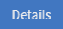</img> button. This will open the project dashboard.

	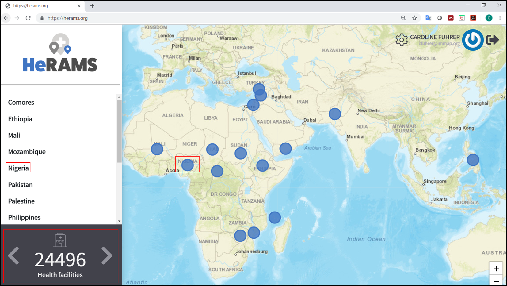</img>

### Dashboard

Each project in HeRAMS has a custom dashboard that enabeling users to explore the available data in more depth.
1. To view a project dashboard, open the project summary by selecting your project form the navigation pane on the left. Alternatively you can open the project summary by clicking the corresponding blue dot on the world map.
2. In the pop-up window, click the </img>  button. This will open the project dashboard.
3. You should now see a page similar to the one shown below. In the navigation pane on the left you will find a list of all available pages. 
4. To open a page, click the page name in the navigation pane. 

	</img>

	</img>
	<i> Some page may contain sub-pages, indicated by a </img> icon next to the page's name.</i>

5. To return to a previous page, you can either select the page in the navigation pane on the left, or use the breadcrumb trail on top of the dashboard. 
For example, the image below displays a sub-page of the Nigeria dashboard. To return to the first page of the dashboard, click on *Nigeria* in the navigation pane. 

	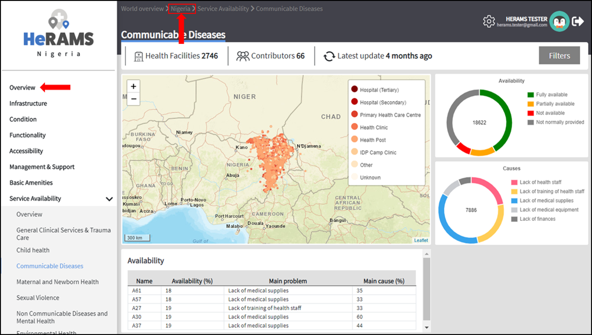</img>

	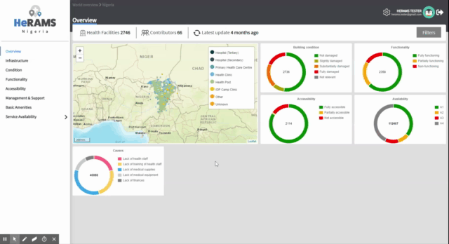</img>

#### Customizing the dashboard

This section provides a few tips and tricks on how to customize the dashboard (e.g. by applying filters or limit the number of structures displayed on a map).

 - ***Mouseover messages***: If you hover with your mouse over a point on the map or the chart, you will see a small pop-up message appearing displaying further information.
 - ***Adjust the map zoom level and focus area***: You can adjsut the zoom level of the maps using the scroll button on your mouse. In addtion, you can change the focus area of the map. 
 Make sure your mouse is located in the map element. Right click and then drag the map in the desired direction. This will move the map focus area.
 - ***Remove items for charts or maps***: By clicking on the icons in the legends, you can remove items from a chart or map.  To add it again, simply click the circle again.
 - ***Reorder map elements***: If the map is zoomed out, it might happen that several points lay on top of each other. To bring a specific category to the front, uncheck the category in the legend. This will remove the category from the map. If you add the category back (click the now empty circle), the category will be added on top of the other points.
 
 

	</img>

 
 - ***Apply filters***: You can further customize the dashboard and explore the data by applying filters.
   1. In the top right corner of the dashboard, click the 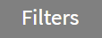</img>  button.
   2. You should now see the filter configuration page. Use the drop-down list to select your filter criteria. Repeat this process until you have added all the desired filter criteria.

   

	</img>
	<i> If you apply multiple search criteria, only results that contain all terms will be shown.</i>

   

	</img>
	<i> You can limit the number of fields displayed using the search filed on top of the page.</i>

   3. Click the 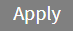</img> button to activate your filter.

	</img>

#### Default dashboard pages

The below section provides an overview of the standard pages available in a dashboard. Each page refers to a HeRAMS standard information pillar.

	</img>
	<i> Please note that the order and the content of dashboards is customized based on the needs for individual projects. Your dashboard might therefore by substantially different from the example pages displayed below. </i>

	
<b><i>Page 1:</b> Overview</i>
	

The **Overview** page provides a summary, in form of: 
-  A map to spot the distribution and number of health facilities by level of care (i.e. primary, secondary and tertiary health care facilities); and
-  Doughnut  charts to summarize different indicators, such as level of damage, functionality status, accessibility and service availability in the assessed health facility.

	</img>
	<i> Note that service availability is country specific. Thus, direct comparisons form one country to another should be avoided.</i>

	</img>

	
<b><i>Page 2:</b> Infrastructure</i>
	

The **Infrastructure** page, displays a descriptive analysis, including:
-  a map to spot the distribution and number of health facilities by type; 
-  doughnut charts to illustrate **Mo**des of **S**ervice **D**elivery (MoSDs) by type as well as the modality of the building structure (permanent vs. temporary); and
-  a table to illustrate reported accessibility barriers.

	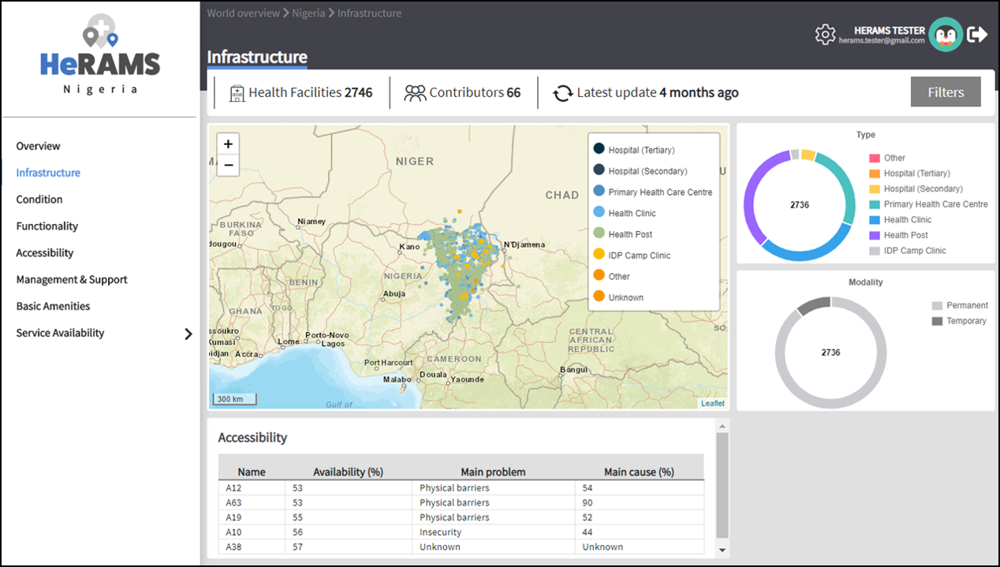</img>

	
<b><i>Page 3:</b> Condition</i>
	

The **Condition** page displays the level of reported damage to MoDS buildings following a standard classification and scale (Not Damaged to Fully Damaged). Information is visualized as: 
-	a map to spot the distribution and number of health facilities according to the level of building damage (i.e. condition);
-	doughnut charts summarizing the reported level of building damage by level of severity as well as the distribution of MoDS by type; and
-	a table to provide the name of the prioritized localities in terms of damage and their main causes.

	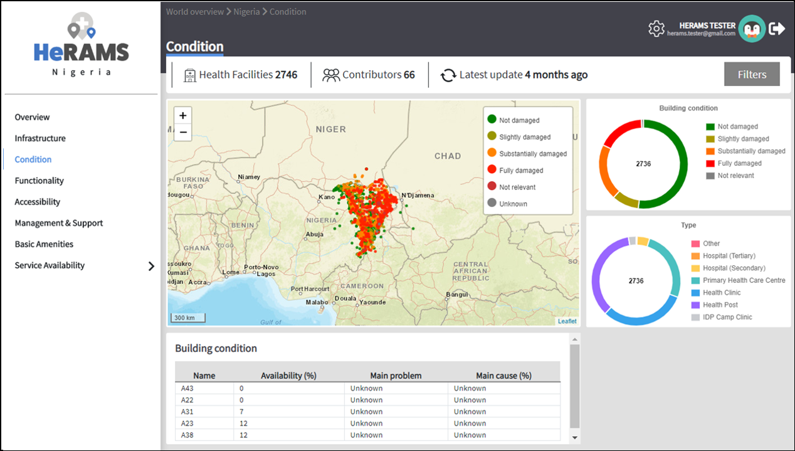</img>

	
<b><i>Page 4:</b> Functionality</i>
	

	
The **Functionality** page displays the level of functionality of the MoSDs following a standard classification and scale (Fully Functioning to Not Functioning) represented as:
-	a map to spot the distribution and number of MoSDs according to the functionality status;
-	doughnut charts to summarize the level of functionality as well as main causes of non-functionality; and
-	a table displays the list of priority areas in terms of non-functional health facilities and reported causes. 

	</img>

	
<b><i>Page 5:</b> Accessibility</i>
	

	
The **Accessibility** page displays the level of accessibility to MoSDs following a standard classification and scale (Fully Accessible to Not Accessible) in the form of:
-	a map to spot the distribution and number of MoSDs according to the accessibility status;
-	doughnut charts to summarize the level of accessibility per number of MoSDs as well as the reported causes of inaccessibility per number of MoSDs; and
-	a table displays the list of priority areas with inaccessible MoSDs and the main reported cause of inaccessibility. 

	</img>

	
<b><i>Page 6:</b> Management & Support</i>
	

	
The **Management & support** page displays information on the management of the MoSDs and the level of support provided by partners. The information is illustrated in terms of: 
- Ownership:
	-  A map to spot the distribution of MoSDs according to their ownership (i.e. public, private, faith-based and, NGO/iNGO).
	-  A doughnut  chart to highlighting the categories of ownership as a percentage of the total number of MoSDs.
- External support:
	-  A doughnut  chart to illustrate the level of support provided by partners.

	</img>

	
<b><i>Page 7:</b> Basic Amenities</i>
	

	
The **Basic Amenities** page presents a series of doughnut  charts displaying information of core areas such as:
- the principle source of water and power; and
- the percentage of MoDS with sufficient water and power supplies

	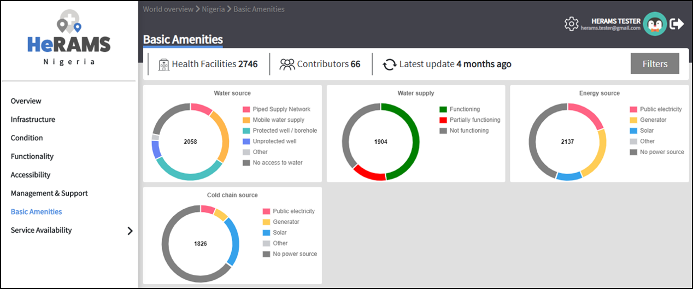</img>

	
<b><i>Page 8:</b> Service Availability</i>
	

	
The **Service Availability** page displays multiple pages per type of service. Each page displays:
-	a map to spot the distribution of the MoSDs providing the selected health service;
-	doughnut charts to summarize the level of service availability as well as the underlying causes of unavailability of the service; and
-	a table displays the list of priority areas per service unavailability and the main reported underlying cause.

	</img>

### Download data

Users who would like to peform additional, in-depth analysis can download data for individual workspaces following the instructions below. 

	</img>
	<i> In order to download data, you will require access to the corresponding workspace. Contact your system administrator to elevate your access rights if needed.</i>

1. Go to the workspace page of your project(see [Access the Data Edit Interface](#access-the-data-edit-interface) steps 1-4 for detailed instructions).
2. In the rightmost column, click the </img> button. This will download all records (MoDS) of this workspace.

	</img>
	<i> For surveys that are not in English make sure to correctly define the encoding when opening the data in Excel (see [Data Encoding in Excel](#data-encoding-in-excel) for details).</i>

#### Download the entire data set

*Coming soon*

	</img>
	<i> Users are advised to download data for individual workspace as outlined above. The ability to download the entire data set is restricted to few users. Contact your system administrator for further information.</i>

#### Data Encoding in Excel

When you open your data in Excel, it is important to select the correct (UTF-8) encoding. 

	</img>
	<i> Using the worng encoding can result in unreadable text. For examples instead of <b>camp de réfugiés</b> you get *Camp de réfugiés*.</i>

1. Open a new Excel file.
2. On the Data tab in the **Get & Transform Data** group, click **From Text/CSV**.
3. In the **Import Data** dialog box, locate and double-click the text file that you want to import, and click **Import**.
4. In the top left corner of the pop-up window that opens, change the encoding type to **UTF-8**, and click **Import**.

	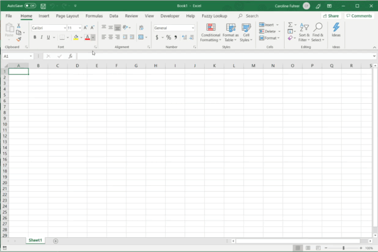</img>

# 3. Edit Data

The following section provides a step-by-step guide on how to access the data edit interface, create, edit and delete health facilities.

	</img>
	<i> Please not that access to the data edit interface is limited to data data managers responsible to update the data.  
	Should your role require you to contact any of the functions described in this sections, contact your system administrator in order for your permissions to be adjusted accordingly.</i>

### Access the Data Edit Interface

1. Open the admin interface, by clicking the </img> button on the top right corner of the page, next to your name. 
2. From the navigation pane on the left, select [Projects](https://herams.org/project/index).
3. You should now see a table of all available projects. For each project, the table displays the number workspaces, contributors, health facilities and responses. 

	</img>
	<i> The number of responses can be higher than the total number of health facilities. This indicates that a health facilitiy was assessed multiple times over a specfic time frame.</i>

4. In the rightmost column, click the </img> icon. This will open the list of available workspace.

	</img>
	<i> HeRAMS uses so called workspaces to manage access permission to the underlying data and enable a granual access control mechanism. 
	A workspace might for example constitute a specific organization or a geographic region. For more information on workspace click <a href="#workspaces">here</a>.</i>

5. To view the health facilities that are part of a specific workspace, click the </img> icon in the *Action* column. 

	</img>
	<i> Be aware that a workspace might have multiple pages. Use the </img> to move to the next page or filter the workspaces by typing the workspace name in the field below the header row.</i>

	</img>

6. You should now see a table with all the health facilities of the selected workspace. 

	</img>

### Edit a Health Facility

	</img>
	<i> Please note that editing a record will override the existing record. If you would like to update the status of a health facility while keeping a record of the changes might, follow the instructions in the section below.</i>

1. To edit a record click the </img>  icon in the left most column. 

	</img>
	<i> Be aware that a table might have multiple pages. Use the button in the button left corner to advance to the next page. You can also reduce the number of records displayed by applying filters.</i>

	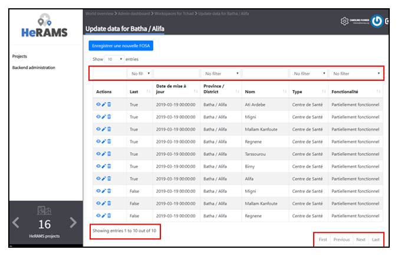</img>

2. You should now be able to edit the selected record. Use the  </img> buttons in the lower right corner to move to the next page of the questionnaire or return to the previous page. 
You can also use the navigation pane on the left to access a specific section of the questionnaire.
3. To save your changes, navigate to the last page **Validate** and click the </img> button.
4. If you would like to discard your edits, click the </img> button in the lower right corner of the page. 

### Update a Health Facility

If HeRAMS is used as a monitoring tool, you can update health facility without while keeping the existing information. 

	</img>
	<i> Please note that the ability to update records is not enabled in all projects. Contact your system administrator for further information.</i>

1. To update the status of a Health Facility, use the </img>  button to open the record.
2. Use the two button on the bottom right side to move to the next page of the questionnaire or return to the previous page. You can also use the navigation pane on the left to access a specfic section of the questionnaire.
3. To save your changes, open the last page (**Validate**) and click  </img>.
4. If you would like to discard your edits, click the </img>  button.

### Register a new Health Facility

1. To create a new record, click the button  </img>.  
2. Use the two button on the bottom right side to move to the next page of the questionnaire or return to the previous page. You can also use the navigation pane on the left to access a specfic section of the questionnaire.
3. To save your changes, navigate to the last page **Validate** and click  </img>.
4. If you would like to discard your edits, click the </img>  button 

### Delete a Health Facility

1. To delete a record, click the </img> icon in the first column. 

	</img>
	<i> Deleting records cannot be undone. Be careful when deleting a record.</i>

# 4. HeRAMS Administration

This chapter aims to provide an overview of the admin pages in HeRAMS and provides step-by-step instruction for common tasks conducted by advanced users and local administrators. 
The first part of the chapter introduces the the concept and management of [Workspaces](#workspaces) while the second part focuses on [Project](#projects) level administration as well as the configuration of project specific [Dashboards](#configure-the-project-dashboard). 

	</img>
	<i> Access to each of the sub-sections of this chapter are depending on the tasks a users is expected to complete. If you require your permissions to be changed, please contact your system administrator.</i>

### Workspaces

HeRAMS uses the concept of workspaces to manage user permissions. Each workspace consists of several health facilities and has a dedicated focal point responsible for updating these records. 
A workspace might for example include all health facilities of a geographical region, health facilities managed by a specific partner or any other logical category. 
Thus, the use of workspaces in combination with different levels of permission (see below) assures granular, role-based access control to a project and the underlying data. 
While most users only have access to a single workspace, local administrators might have access to several or all workspaces. Moreover, local administrators often perform  user management tasks such as adding new users to a workspace, change a user's permission or to create additional workspaces.

- </img> **Data Refresh**: This button allows users to manually refresh the data cache of a workspace.
- </img> **Update Workspace**: allows to change the title or token of a workspace.
- </img> **Share Workspace**: Access to workspaces is granted by sharing a workspace with users. For more information on how to add users to a workspace click [here](#add-a-user-to-a-workspace).
- </img> **Delete Workspace** See [Delete Worksapces](#delete-workspaces) for further information
- </img> **Download Data**: Downloads all data associated with the workspace. See *chapter 2* for more informatio on [data download](#download-data).  
- </img> **Data Update**: This opens the data edit interface. More infomration on data editing and updating is available in the [previous chapter](#edit-data).  

	</img>
	<i> The number of buttons visible to you depends on your access rights and might vary from one workspace to another.</i>

#### Workspace Permissions

There are two permission levels that a user can be granted to a workspace. Users with the role of **Data Editor** have access to update the response data (option 1) while **Workspace Owners** might be given elevated permission (option 2) allowing them to add additional users to their workspace.1. Manage the underlying response data

1. Manage the underlying response data
2. Full access, includes editing the workspace properties, token and response data

#### Add a User to a Workspace
1. To grant a user access to a workspace, open the admin interface by clicking the </img> icon in the top right corner of the screen.
2. In the navigation pane on the left, click [Projects](https://herams.org/project/index) to open the Project overview's table (see [Projects](#projects) for more information).
3. In the rightmost column of the table, you should see several action buttons. Click the </img>  icon. This will open the workspace of the selected project.  
4. You should now see a table with all workspaces of your project. For each workspace the table provides information on the last time data was synced with the underlying database, the number of contributors, health facilities and responses. Alike the project table, the last column contains several action buttons. 
5. To grant a user access to a workspace (e.g. to update the data), you have to share the workspace with them. Click the </img> icon in the *Actions* column.
6. You should now see something similar to the image below. On the bottom half of the screen you can see a list of all users currently having access to this workspace and their permission level. 

	</img>

7. In the top half the page you have the option to add a user. Start typing the users name in the top field. You will notice that the list of users is dynamically filtering. Select the user you would like to add.

	</img>
	<i>You can add multiple users add once as shown in the image above.</i>

	</img>
	<i>If you cannot find a users, it means the user has not create an account. Ask the user to greate an account by registering on the <a href="https://herams.org">HeRAMS platform</a> and then retry. Should the issue persist, contact your system administrator.</i>

8. Use the checkboxes to select the apropriate permission level. See the previous section for further details on [Workspace Permissions](#workspace-permissions).
9. Click the 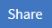</img> button to share the workspace with the selected user(s).

	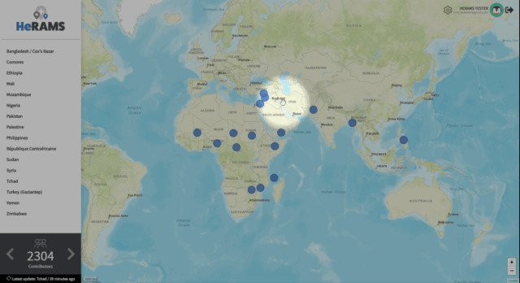</img>

#### Remove a User from a Workspace

1. To remove a user from a workspace, navigate to the workspace from which you would like to remove a user. Follow steps 1 - 6 outlined [above](#add-a-user-to-a-workspace) to access the workspace.
2. On the second half of the screen you should now see a list of all users having access to the workspace. Click the </img> icon to remove the user permanently. 

#### Change a User's Workspace Permission

1. To change a user's permission, remove the user from the workspace as outlined [above](#remove-a-user-from-a-workspace).
2. Now add the user again using the new permission level (see section [Add a User to a Workspace](#add-a-user-to-a-workspace) for details).

#### Create a New Worksapce

1. To create a new workspace, access the workspace page of your project (Follow steps 1 - 6 in the [Add a User to a Workspace](#add-a-user-to-a-workspace) section).
2. On the upper left corner, you should see a button labelled 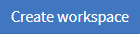</img>.
3. On the page that opens, you should now be able to create a new workspace. 

	</img>

4. Enter the workspace name into the title field. 
5. Use the dropdown list to select the corresponding **Token** or create a new token by selecting *Create new token*.

	</img>
	<i> Tokens are unique identifiers that link health facilities to workspaces. To add a health facility to a workspace the token of the record in question has to be manually changed. Contact your system administrator for guidance on how to change a record's token.</i>

#### Delete Worksapces

1. You can remove a workspace by clicking the </img> icon in the **Actions** column next to the selected workspace.

	</img>
	<i> Deleting workspace will not affect the underlying data. See the previous chapter to learn how to permanently <a href="#delete-a-health-facility">remove health facilities</a> from your project.</i>

### Projects

The <a href="https://herams.org/project/index">Projects</a> page provides a brief overview of all projects available on the HeRAMS platform. 

	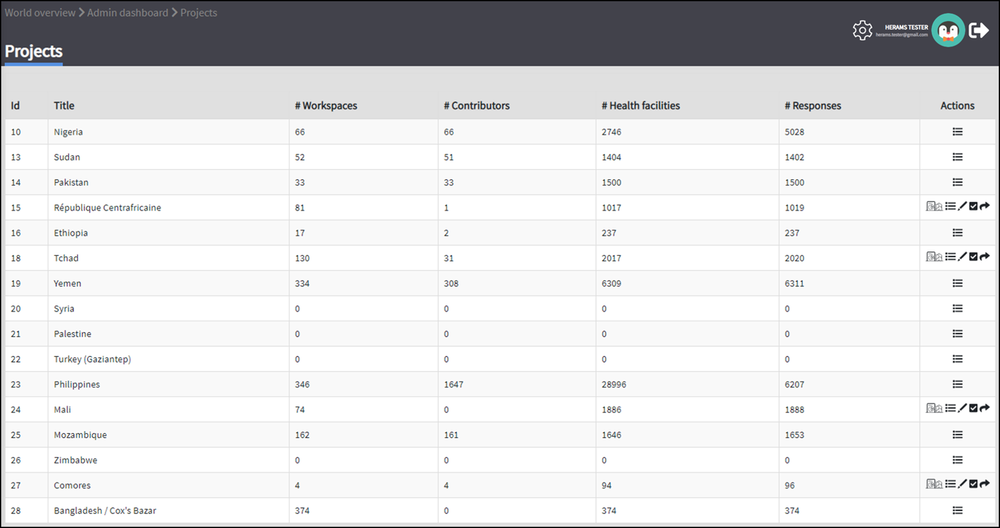</img>

For each project the number of workspace, contributors, health facilities, and responses is displayed. Alike the table of workspaces, the last column contains a series of action buttons. 

- </img>**Workspaces**: For more information on workspaces click [here](#workspace).
- 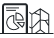</img>**Dashboard**: By clicking the dashboard icon, the project [dashboard](#dashboard) will be opened. 
- </img>**Edit**: Permits users with appropriate permission to alter the  project [settings](#project-settings) as well as to configure the project [dashboard](#configure-the-project-dashboard). 
- </img>**Check Data**: Can be used for a quick review of the data to identify invalid responses.
- </img>**Share**: The sharing function is used to grant users access to a project. See [below](#add-a-user-to-a-project) for further details.

	</img>
	<i> The number of buttons visible to you depends on your access rights to a specific project is likely to vary from one project to another.</i>

#### Project Permissions

Tere are three permission levels which can be used to grant a user access to a project. 

1. Allow access to the project dashboard from the world map
2. Allows full access to all workspaces in this project as well as creating new ones or deleting existing ones
3. Allow everything

#### Add a User to a Project

1. To grant a user access to a specific project, open the admin interface by clicking the </img> button in the top right corner of the screen.
2. In the navigation pane on the left, click [Projects](https://herams.org/project/index) to display the list of all available projects.
3. In the rightmost column of the table, you should see several action buttons. Click the </img> icon. 
4. You should now see something similar to the image below. On the bottom half of the screen you can see a list of all users currently having access to this workspace and their permission level. 

	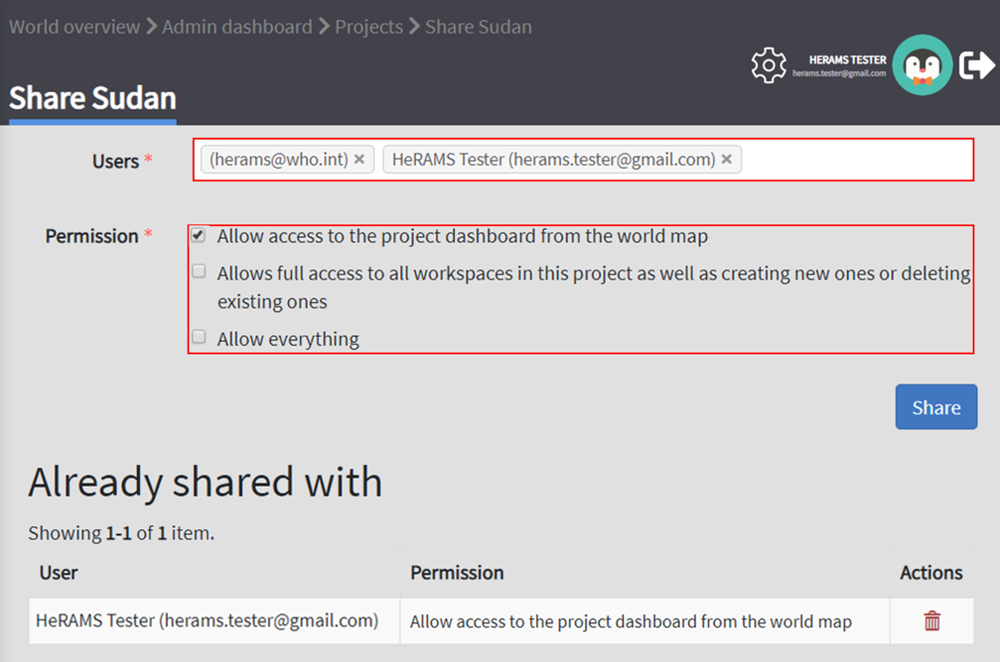</img>

5. In the top half the page you have the option to add a user. Start typing the users name in the top field. You will notice that the list of users is dynamically filtering. Select the user you would like to add.

	</img>
	<i>You can add multiple users add once as shown in the image above.</i>

6. Use the checkboxes to assign appropriate permission rights. See [Project Permissions](#project-permissions) for further information on the different permission levels.
7. Click the </img> button to share the project with the selected users.

	</img>

#### Remove a User from a Project

1. To remove a user from a Project, follow steps 1-4 outlined in the [previous section](#add-a-user-to-a-project) to access the project from which you would like to remove a user.
2. On the second half of the page you should now see a list of all users having access to the workspace. Click the </img> icon to remove the user permanently. 

#### Change a User's Project Permissions

1. To change a user's permission, remove the user from the project as outlined [above](#remove-a-user-from-a-project).
2. Now add the user again using the new permission level (see section [Add a User to a Project](#add-a-user-to-a-project) for details).

#### Modify a Project

1. To update the general settings of a project, open the admin interface by clicking the </img> button in the top right corner of the page.
2. Open the Projects's overview table by selecting [Projects](https://herams.org/project/index) in the navigation pane on the lefts to open the project overview page.
3. Click the </img> icon in the **Actions** column of your project. This will open the general settings page.
4. You should now see a page similar to the one displayed below, which permits you
	- to update the project title;
	- to alter the survey linked to this project;
	- to change the centroids (latitude and longitude) used on the world map;
	- to update the status of the project;
	- to configure the pop-up information displayed on the main page; and
	- to congifure the project dashboard (Additional information on how to configure the project dashboard is available [here](#configure-dashboard)).
5. Make sure you save your changes by clicking the 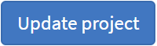</img> button.

### Configure the Project Dashboard

For each HeRAMS Project, an interactive dashboard has been configured providing users with an indepth overview of the project and summarizing key indicators. 
This section provides project administrators with detailed description on how to edit these dashboards. 
An overivew of the standard dashboard pages is available in [Chapter 2](##default-dashboard-pages). 

#### Modify an Existing Dashbaord Element

Users with the permissions to edit dashboards can modify charts and maps directly from within the dashboard. 

1. Open the dashboard and navigate to the element you would like to change. 
2. In the top right corner of the element you should see a </img> icon. Click it to open the element's configuration page.
3. You should now be able
	- to change the colors of a map or a chart;
	- to rename the element; and
	- to change the element type.
4. Save your changes by clicking the 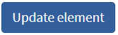</img> button.

	</img>

	</img>
	<i> Dashboard elements can also be edited from the  [Add an Element to a Page](#add-an-elements-to-a-page).</i>

#### Add an Element to a Page

After creating a page, you should now be able to add elements (charts, maps or tables) to a dashboard page. For more information on how add a dashboard page see [above](#add-a-new-page). 
1. Open the page you would like to modify using the </img> icon next to the page's name.
2. In the bottom half of the page you should see a button labelled **Create element**.
3. Click the 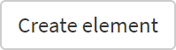</img>. This will open a new page allowing you to create a new element.
4. You should now see a page similar to the one displayed below. 
5. First you will have to select whether to transpose elements and allow to switch between aggregating data at the health facility and service level. 

	</img>Changing this will reload the making you lose all other unsaved edits.</i>

6. Use the **Code** dropdown list to select which field you would like to display on your element.
7. Now select the element type from the **Type** dropdown list.
8. Click the 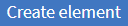</img> button to add create the element.
9. You should now see a sample of the new element in the top right corner.

**Maps and charts:**
10. Upon saving the element, the list of unique values should appear. 
11. To change the color of a category, click on the color displayed. This will open a color picker allowing to select custom colors.
12. Click the </img> button so save your changes. You should now see your changes in the preview on the top right corner of the page.

	</img>

**Tables:**
13. A table requires three variables. The 

For charts, you can increase/decrese the marker size by changing the **Marker Radius**. 

#### Add a New Dashboard Page

1. To edit a projectOpen the project settings page as outlined above(#edit-project-settings)
2. In the lower half of the page you see a table listing all available pages of the dashboard. 

	</img>

1. To create a new page, open the [project's settings](#edit-project-settings) page and click the 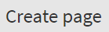</img> button.
2. You should now see a page similar to the one displayed below. 

	</img>

3. Enter the page name in the top field. 
4. The **Parent Id** field is only required if you intend to create a sub-page. From the drop-down select the page to which you would like to add a subpage. 
5. The **Sort** index indicates the position of the new page. E.g. the first page of dashboard should have a sort index of **1**.
6. Click the </img> button to add the page to the dashboard. 
7. If you return to the previous page, you will that your page was added to the list of pages. 

	</img>
	<i> you only created an empty page. To add elements to your page, see section [Add an Element to a Page](#add-an-elements-to-a-page).</i>

### Update a Dashboard Page

1. To alter an existing page, click the </img> icon next to the page's name. This will open the page's setting page. You are now able to change the title and the order of the page. See [above](#add-a-new-page) for further details. 
2. On the page that opens you should now be able to alter the page name, and display order.

### Delete a Dashboard Page

To delete a dashboard page, click the </img> icon.

	</img>
	<i> Deleting dashboard pages and elements cannot be undone. Be careful when deleting pages or elements.</i>

#### Remove an elements or pages from the dashboard
To remove elements form a page, return to the dashbo
2. In the lower half of the page you will see the list of all items displayed on the selected page. 
3. Use the </img> to permanently delete the element.

	</img>
	<i> Be careful deleting dashboard elements. Deleted elements cannot be restore.</i>

# 5. FAQ
This section aims to help users troubleshoot frequently encountered issues. In case you encounter an issue that is not addressed here, please post it in the comment section. We will periodically update this section to 

	
<b>I did not recieve an email when register/resting my password</b>
	

	
If you did not receive an email upon registering or resetting your password, follow the steps below to troubleshoot the issue. 
1. Refresh your inbox. It might take a few minutes for email to appear.
2. Check your spam/junk folder.
3. Try to register again. You might have made a mistake typing your email. 
4. If that still does not work, try contacting, contact your administrator for help. 

	
<b>How can I reset my password?</b>
	

	
Passwords can be reset by navigating to your [account](https://herams.org/user/settings/profile) and click the [account](https://herams.org/user/settings/account) link. For more details, follow the instructions [here](#change-password).
In case you forgot your password you can use the [Reset password](https://herams.org/user/forgot) link on the sign in page. See [here](#reset-password) for more details. 

	
<b>Data export is unreadable or contains weird characters</b>

	
If open your data in Excel, you might experience an issue with special characters not displaying properly. For example, instead of *camp de réfugiés* you get *Camp de réfugiés*. The reason for this is that Excel not using the correct encoding type to read you date. To correct the issue, follow the instruction outlined here. 

	
<b>How can see if I have access to a specific dashboard</b>

		coming soon

	
<b>Where can I see the list of workspaces</b>

		coming soon

	
<b>Title</b>

		coming soon

	
<b>Title</b>

		coming soon

	
<b>Title</b>

		coming soon

	
<b>Title</b>

		coming soon

